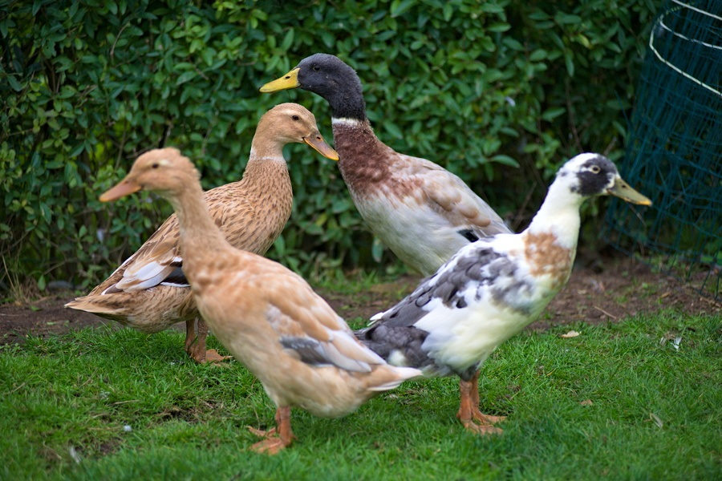
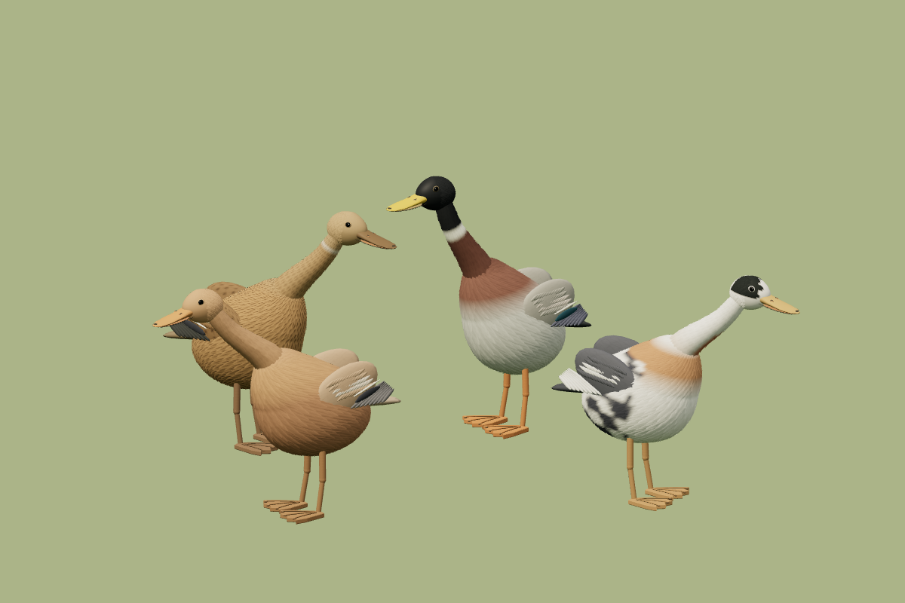

# Gistrup Ande TV

En interaktiv 3D-pauseskærm med vores fire løbeænder: tre hunner og én han. De går rundt i haven, søger føde, bader, pudser fjer og følger hinanden. Udseende og bevægelser er inspireret af fotos og videoer af de rigtige ænder. Vejr og døgnrytme følger Gistrup og kan også indstilles manuelt.

[Åbn Ande TV](https://krauhe.github.io/DuckTV/) · [QR-kode til udskrift](https://krauhe.github.io/DuckTV/ande-tv-qr-print.pdf)

## Fra foto til 3D

| Vores fire ænder | Modellerne i Ande TV |
| :---: | :---: |
|  |  |

Klik på græsset for at kaste pasta. Træk med musen for at dreje kameraet, og brug musehjulet til at zoome. Kameraet kan også følge flokken automatisk.

## Kør lokalt

Kræver Node.js 22.12+ og pnpm.

```sh
pnpm install
pnpm dev
```

Åbn adressen, som terminalen viser, normalt [localhost:5173](http://127.0.0.1:5173/). På Windows kan `Start-Ande-TV.ps1` også starte siden, når pakkerne er installeret.

Bygget med TypeScript, Three.js og Vite. Kør `pnpm test` for tests og `pnpm build` for en produktionsbygning.
